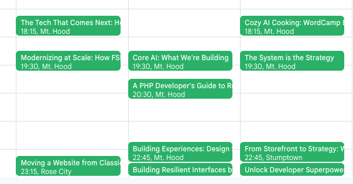

# WordCamp Favorites Calendar Generator

A Python script to extract your favorite sessions from any WordCamp schedule and generate an ICS calendar file.



## What it does

- Takes a WordCamp schedule URL with favorite sessions marked
- Fetches session details via the WordCamp REST API
- Extracts session titles, speakers, locations, and times
- Generates an `.ics` calendar file you can import into any calendar app

## Usage

```bash
python3 wordcamp_favorites.py '<schedule_url_with_favorites>'
```

### Example

```bash
python3 wordcamp_favorites.py 'https://us.wordcamp.org/2025/schedule/?fav-sessions=1834,1952,2303,2644'
```

## Requirements

```bash
pip install requests
```

## How to get your favorites URL

1. Go to any WordCamp schedule page
2. Mark sessions as favorites (usually a star icon)
3. Copy the URL - it will contain `?fav-sessions=1234,5678,9012`
4. Use that URL with the script

## Output

- Console: List of your favorite sessions with details
- File: `wordcamp_favorites.ics` calendar file
- Import the `.ics` file into Google Calendar, Apple Calendar, Outlook, etc.

## Features

- Works with any WordCamp site that uses the standard WordPress REST API
- Handles large numbers of favorites (automatically chunks API requests)
- Proper timezone handling (Pacific Time for US events)
- Includes session titles, speakers, and room locations in calendar events

## Example Output

```
Found 4 favorite sessions: 1834, 1952, 2303, 2644
Retrieved 4 sessions

Favorite Sessions:
--------------------------------------------------
• Building Resilient Interfaces by Embracing Fluid Design
  Speaker(s): Anton Plauche
  Location: Mt. Hood
  DateTime: 2025-08-28T14:45:00

Calendar saved to: wordcamp_favorites.ics
```
Collaborated with Claude Code ([See session log](https://docs.google.com/document/d/13BWhaKr0XU_UyFAbdfRmlXe8KYKmsZwJ62B2NsyD2JQ/edit?usp=sharing))